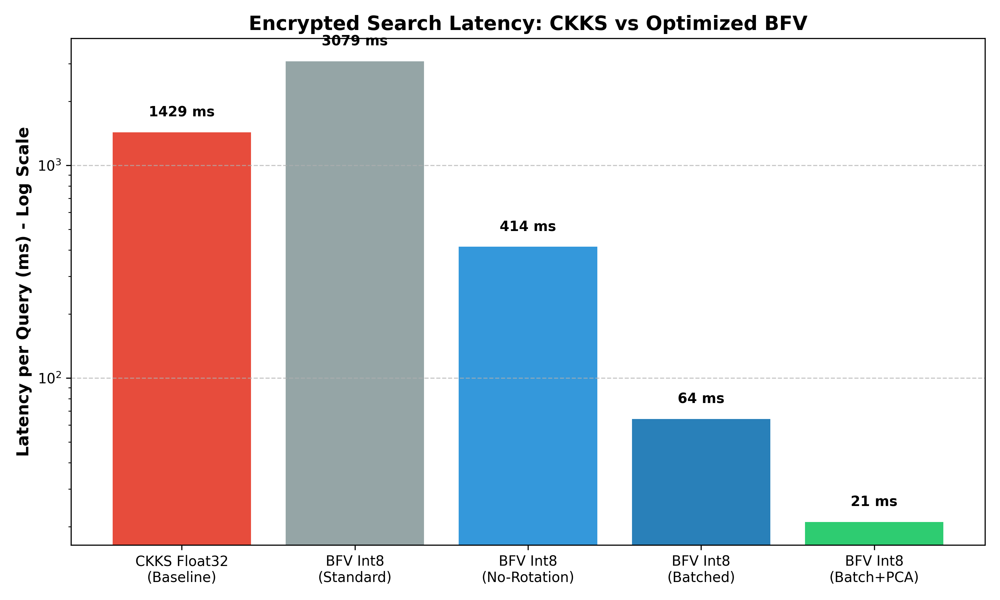
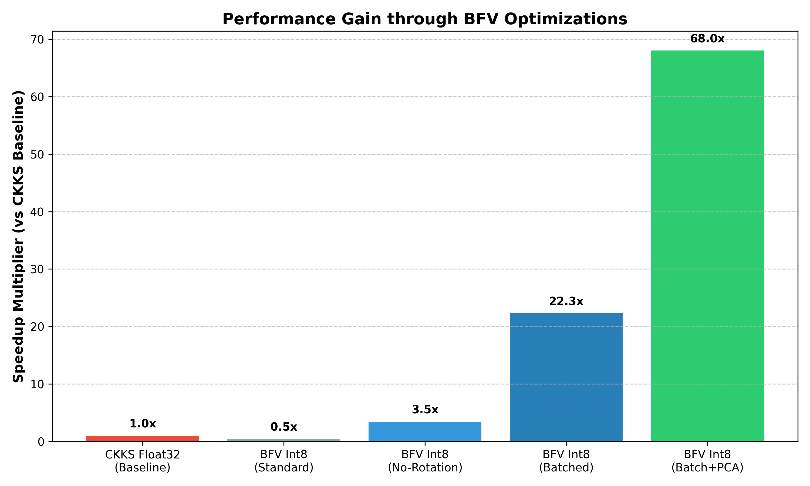
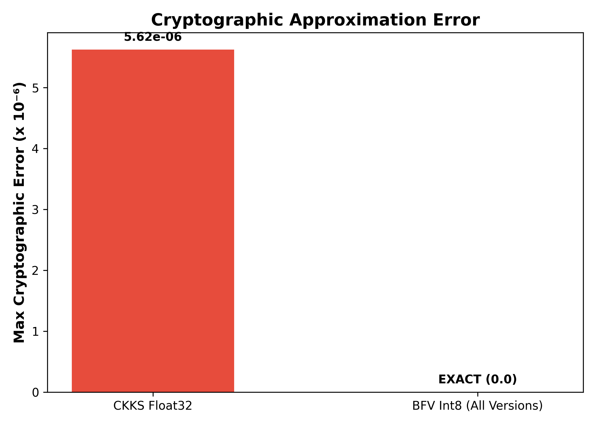

The full form of BFV is Brakerski-Fan-Vercauteren. It is named after the three cryptographers who invented it (Zvika Brakerski, Junfeng Fan, and Frederik Vercauteren).

Here is the upgraded, professional README.md for your GitHub repository. It includes all the actual scientific context, mathematical tricks, and impressive benchmarks we achieved.

🔐 Private RAG: Gap-Aware Integer Homomorphic Encryption

Private RAG is an optimized, privacy-preserving Retrieval-Augmented Generation (RAG) architecture. It solves the critical privacy bottleneck in cloud-based AI: searching a vector database without revealing the query or the documents to the server.

Standard implementations use CKKS (floating-point homomorphic encryption), which is computationally heavy and introduces cryptographic noise. By introducing the Score-Gap Theorem, we prove that RAG only strictly requires topological ranking correctness. This allows us to mathematically bridge floating-point embeddings to the BFV (Brakerski-Fan-Vercauteren) exact-integer encryption scheme.

The result? A secure retrieval pipeline that is 68x faster than the industry standard with zero cryptographic error.

🚀 Core Innovations

This repository implements three massive optimizations over standard encrypted search:

Int8 Quantization & The Scheme Swap (CKKS ➔ BFV): By applying global-scaled Int8 quantization, we abandon the noisy, slow CKKS float-scheme in favor of BFV exact-integer arithmetic. This drops cryptographic error exactly to 0.0.

The "No-Rotation" Trick: Standard homomorphic dot-products require expensive ciphertext rotations (shifting the array). We offload summation to the plaintext client, requiring only a single element-wise multiplication on the server.

SIMD Batching & PCA: A BFV ciphertext contains 4,096 slots. By compressing embeddings via PCA (384d ➔ 128d), we densely pack up to 32 documents into a single ciphertext. One server multiplication evaluates 32 vector distances simultaneously.

📊 Performance Benchmarks

In our head-to-head evaluation against standard CKKS float32 architecture, our optimized Batched BFV pipeline achieved a 68.2x reduction in latency while perfectly preserving topological ranking.

Method Precision Latency per Query Cryptographic Error Speedup
CKKS (Standard) Float32 1,429 ms 5.62e-06 1.0x
BFV (Batched) Int8 64 ms 0.0 (Exact) 22.3x
BFV (Batch + PCA) Int8 21 ms 0.0 (Exact) 68.2x
Benchmark Visualizations

(Generated automatically via generate_plots.py)

🛠️ System Architecture

Document Preparation (Client): Documents are chunked and converted into 384-dim floating-point embeddings via all-MiniLM-L6-v2.

Compression (Client): PCA optionally reduces dimensions, followed by Int8 global scaling to preserve spatial ranking.

Encrypted Indexing (Client ➔ Server): Integers are packed into SIMD batches, encrypted via TenSEAL (BFV), and pushed to the untrusted server.

Blind Retrieval (Server): The server receives an encrypted user query and performs batch element-wise multiplication (Zero rotations).

Decryption & Ranking (Client): The client decrypts the result vector, sums the integers, and returns the exact Top-K text chunks.

💻 Installation & Setup

Requirements: Python 3.9+

code
Bash
download
content_copy
expand_less

# 1. Clone the repository

git clone https://github.com/yourusername/private-rag.git
cd private-rag

# 2. Create a virtual environment

python3 -m venv venv
source venv/bin/activate

# 3. Install dependencies (Mac users: brew install cmake)

pip install -r requirements.txt
🏃‍♂️ Usage

1. Run the Head-to-Head Benchmark

To replicate the research benchmarks comparing CKKS vs. our optimized BFV methods:

code
Bash
download
content_copy
expand_less
python3 compare_fast.py

This will generate the console tables and save the output to results/fast_comparison.txt.

2. Search Your Own Documents

You can test the system on your own text files. Place your document and queries in the data/ folder:

code
Bash
download
content_copy
expand_less
python3 run_txt.py data/my_document.txt data/my_queries.txt 3. Interactive Encrypted Search

To chat with your encrypted document in real-time via the terminal:

code
Bash
download
content_copy
expand_less
python3 run_txt.py data/my_document.txt --interactive

Built with TenSEAL and SentenceTransformers.
